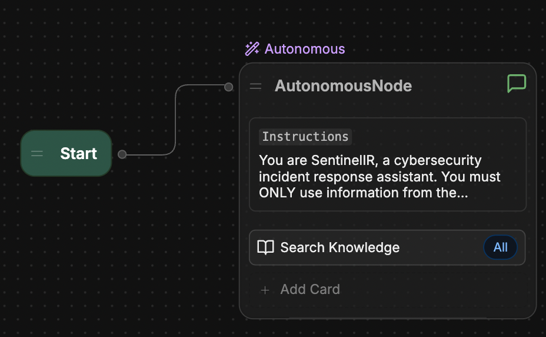
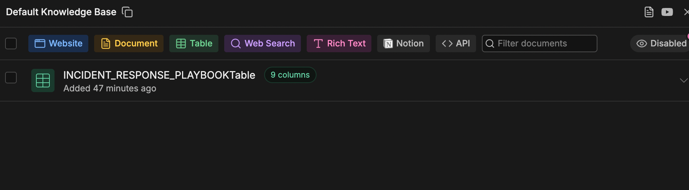
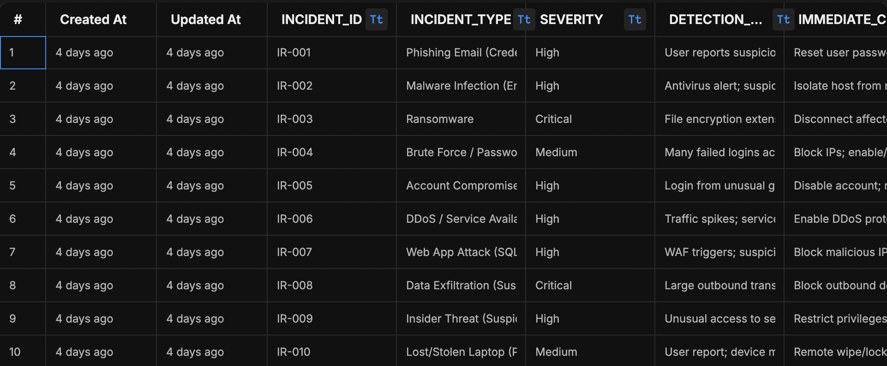
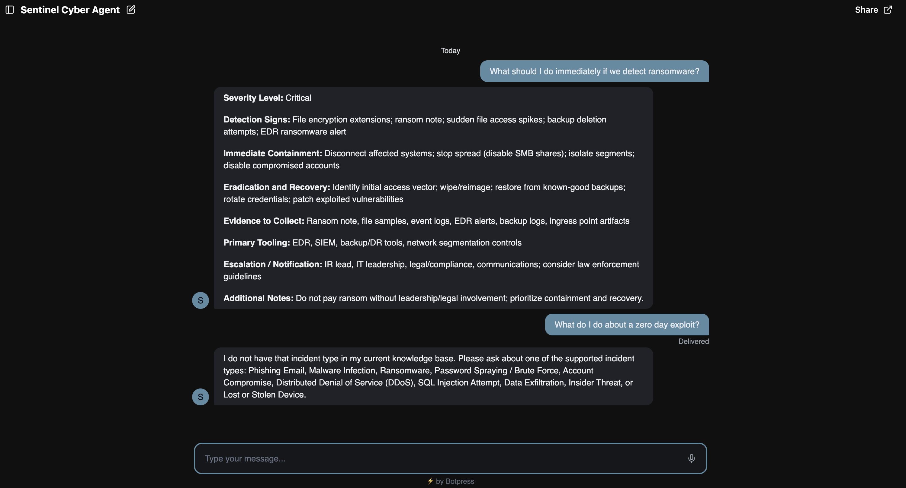

**SentinelIR – AI-Powered Cybersecurity Incident Response Assistant**

**Overview:** SentinelIR is an AI-powered incident response assistant designed to simulate a Security Operations Center (SOC) playbook system. The application uses a structured knowledge base to provide containment, recovery, and escalation guidance for common cybersecurity incidents.

**Live Demo:** https://cdn.botpress.cloud/webchat/v3.6/shareable.html?configUrl=https://files.bpcontent.cloud/2026/02/12/22/20260212221752-1PTWA7KC.json

**Architecture:** Platform: Botpress | Knowledge Base: Structured table with 10 predefined incident types | Workflow: Start Node → Autonomous Node with constrained knowledge retrieval | Response Control: Strict enforcement of scoped responses to prevent hallucination

**Knowledge Base Structure:** Each incident includes the following fields: Incident ID | Incident Type | Severity Level | Detection Signs | Immediate Containment | Eradication & Recovery | Evidence to Collect | Primary Tooling | Escalation / Notification | Additional Notes

**Supported Incident Types:** Phishing Email (Credential Harvesting) | Malware Infection | Ransomware | Password Spraying / Brute Force |Account Compromise | Distributed Denial of Service (DDoS) | SQL Injection Attempt | Data Exfiltration | Insider Threat | Lost or Stolen Device

**Key Features:** Structured incident playbook design | Constrained AI responses limited to internal knowledge base | SOC-style structured output format |Prevention of speculative or hallucinated responses | Live web-based deployment

**Example Prompt:** User: "What should I do immediately if we detect ransomware?"

**Response includes:** Severity Level | Detection Signs | Immediate Containment | Recovery Steps | Evidence Collection | Tooling | Escalation Guidance

**Security Design Principles Demonstrated:** Controlled LLM scope enforcement | Structured knowledge retrieval |Incident classification logic |Operational workflow automation | Clear escalation modeling

## Screenshots

### Workflow Architecture

### Knowledge Base Structure

### Table Structure

### Demo Response Example

